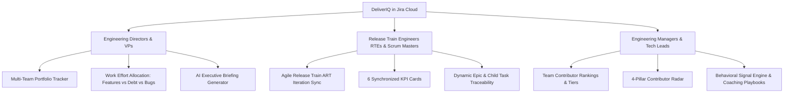

# DeliverIQ — Master End-to-End Product & Technical Architecture Specification

> **The Definitive Context & Knowledge Base for AI Models, Engineers, and Product Leaders**  
> *Product Name:* **DeliverIQ** (internal code name: *ICI Dashboard* — Individual Contribution Index)  
> *Provider:* **Businex Labs** | *Version:* **1.0.0** | *Platform:* **Atlassian Forge (Custom UI for Jira Cloud)**

---

## 📑 Master Table of Contents
1. [Product Overview & Value Proposition](#1-product-overview--value-proposition)
2. [Target Personas & End-to-End User Journeys](#2-target-personas--end-to-end-user-journeys)
3. [System Architecture & Atlassian Forge Framework](#3-system-architecture--atlassian-forge-framework)
4. [Mathematical Scoring Engine & Mathematical Proofs](#4-mathematical-scoring-engine--mathematical-proofs)
5. [Behavioral Signal Detection Engine](#5-behavioral-signal-detection-engine)
6. [Automated 1-on-1 Coaching Playbooks Generator](#6-automated-1-on-1-coaching-playbooks-generator)
7. [Agile Release Train (ART) Sync & Iteration Tracking](#7-agile-release-train-art-sync--iteration-tracking)
8. [Multi-Team Portfolio Tracker & AI Executive Briefings](#8-multi-team-portfolio-tracker--ai-executive-briefings)
9. [Screen-by-Screen UI/UX Specifications](#9-screen-by-screen-uiux-specifications)
10. [Backend Resolvers, Bridge Handlers & Jira REST API](#10-backend-resolvers-bridge-handlers--jira-rest-api)
11. [Data Models & TypeScript Contracts](#11-data-models--typescript-contracts)
12. [Data Security, Privacy & Forge Trust Boundary](#12-data-security-privacy--forge-trust-boundary)
13. [Testing, Build Pipeline & Deployment Operations](#13-testing-build-pipeline--deployment-operations)

---

## 1. Product Overview & Value Proposition

### 1.1 What is DeliverIQ?
**DeliverIQ** is a production-grade **Atlassian Forge Custom UI Application for Jira Cloud** developed by **Businex Labs**. It bridges the gap between raw Jira Software issue telemetry and actionable engineering leadership insights.

DeliverIQ provides two primary capabilities in a single unified app:
1. **Objective Individual Contributor & Team Intelligence:** Eliminates subjective bias from performance reviews, 1-on-1s, and sprint retrospectives by evaluating engineers across four foundational, normalized delivery pillars.
2. **Multi-Team Portfolio & Agile Release Train (ART) Synchronization:** Gives Release Train Engineers (RTEs) and Engineering Directors instant visibility into multi-squad iteration commitments, milestone progress, and cross-project dependency bottlenecks without requiring enterprise suites like Jira Align.

### 1.2 Core Design & Operational Principles
- **Deterministic & Auditable:** Every metric and score is computed strictly from immutable Jira issue changelogs, resolution timestamps, committed due dates, story points, and peer comments.
- **Fair & Normalized:** Delivered velocity and peer collaboration are normalized against team delivery averages with statistical outlier caps (120%) and minimum data guards.
- **Zero External Data Egress:** 100% native Atlassian Forge Cloud app (`storage:app`, `api.asUser()`). All telemetry and calculations remain strictly inside the Atlassian Cloud trust boundary.

---

## 2. Target Personas & End-to-End User Journeys



### Persona 1: Engineering Director / VP of Engineering
- **Objectives:** Monitor overall organizational delivery health, ensure balanced engineering investment (*Features vs. Tech Debt vs. Bugs vs. Maintenance*), detect cross-project dependency bottlenecks, and prepare executive briefings for C-suite meetings.
- **Primary Modules:** *Multi-Team Portfolio Tracker*, *Effort Allocation Charts*, *AI Executive Briefing Generator*.

### Persona 2: Release Train Engineer (RTE) / Program Manager
- **Objectives:** Align cross-squad sprint commitments across an Agile Release Train (ART), track Program Increment (PI) objectives, identify lagging features, and maintain end-to-end task traceability.
- **Primary Modules:** *Agile Release Train (ART) Sync*, *Synchronized KPI Cards*, *Epic Child Traceability Modals*.

### Persona 3: Engineering Manager (EM) / Scrum Master
- **Objectives:** Run fair sprint retrospectives, conduct data-driven 1-on-1s, identify blocked or struggling engineers, detect sprint carry-over churn and review bottlenecks, and provide targeted coaching.
- **Primary Modules:** *Team Dashboard*, *Ranked Contributor Table*, *4-Pillar Radar*, *Coaching Suggestions Engine*.

---

## 3. System Architecture & Atlassian Forge Framework

DeliverIQ is built natively on the **Atlassian Forge** platform using the **Custom UI** architecture:

```
┌─────────────────────────────────────────────────────────────────────────┐
│                          ATLASSIAN JIRA CLOUD                           │
│                                                                         │
│  ┌───────────────────────────────────────────────────────────────────┐  │
│  │                Custom UI Frontend (React 18 + Vite)               │  │
│  │  - @atlaskit design system for native Jira look & feel            │  │
│  │  - Recharts for visual scoring & radar breakdowns                 │  │
│  │  - 7 Screen Modules + Reusable Traceability Modals                │  │
│  └──────────────────────────────────┬────────────────────────────────┘  │
│                                     │ invoke() via @forge/bridge        │
│                                     ▼                                   │
│  ┌───────────────────────────────────────────────────────────────────┐  │
│  │               Forge FaaS Backend (Node.js 22.x Runtime)           │  │
│  │  - src/resolvers/index.ts (Function Dispatcher)                   │  │
│  │  - src/lib/scoring.ts (Pure Mathematical Engine)                  │  │
│  │  - src/lib/signals.ts (Behavioral Detection Engine)               │  │
│  │  - src/lib/portfolio.ts (Aggregation & AI Briefings)              │  │
│  └───────────────────┬───────────────────────────────┬───────────────┘  │
│                      │ api.asUser().requestJira()    │ storage API      │
│                      ▼                               ▼                  │
│  ┌──────────────────────────────────────┐  ┌─────────────────────────┐  │
│  │           Jira REST APIs             │  │   Forge App Storage     │  │
│  │  - /rest/agile/1.0/board             │  │  - Custom Weights       │  │
│  │  - /rest/agile/1.0/sprint            │  │  - Authorized Approvers │  │
│  │  - /rest/api/3/search (JQL+Changelog)│  │  - Portfolio Presets    │  │
│  │  - /rest/api/3/field                 │  │  - Cached Team Scores   │  │
│  └──────────────────────────────────────┘  └─────────────────────────┘  │
└─────────────────────────────────────────────────────────────────────────┘
```

---

## 4. Mathematical Scoring Engine & Mathematical Proofs

DeliverIQ computes a single composite **DeliverIQ Score ($0 \text{ to } 100+$)** for every contributor across selected sprints:

$$\text{DeliverIQ} = w_{\text{onTime}} \cdot S_{\text{onTime}} + w_{\text{delivered}} \cdot S_{\text{delivered}} + w_{\text{quality}} \cdot S_{\text{quality}} + w_{\text{collab}} \cdot S_{\text{collab}}$$

### Standard Default Weights ($w$):
- $w_{\text{onTime}} = 0.35$ (35% default weight)
- $w_{\text{delivered}} = 0.25$ (25% default weight)
- $w_{\text{quality}} = 0.25$ (25% default weight)
- $w_{\text{collab}} = 0.15$ (15% default weight)
*(Weights are fully configurable in Settings and must sum to exactly 100%).*

---

### 4.1 Pillar 1: On-Time Delivery Score ($S_{\text{onTime}}$)
Evaluates actual resolution timestamp ($R$) against the committed due date ($D$):

$$S_{\text{onTime}} = \min\left(\text{Round}\left(\frac{\text{OnTimeIssues}}{\text{EligibleIssues}} \times 100\right), \, 100\right)$$

#### Rules & Mathematical Guards:
1. **Eligible Issues:** A task is eligible if it was resolved within the selected sprints and had a populated `duedate`.
2. **On-Time Condition:** An issue is considered On-Time if:
   $$\text{Date}(R) \le \text{Date}(D)$$
3. **Threshold Guard (`MIN_DATED_ISSUES = 3`):** Contributor must have $\ge 3$ eligible due-dated tasks.
4. **Small Sample Baseline:** If a contributor has $<3$ due-dated tasks, $S_{\text{onTime}} = \text{null}$. In the composite formula, a neutral baseline of **60 points** is used so contributors without due dates are neither unfairly boosted nor penalized.

---

### 4.2 Pillar 2: Delivered Velocity Score ($S_{\text{delivered}}$)
Measures completed story points normalized against the team's average delivery:

$$S_{\text{delivered}} = \min\left(\text{Round}\left(\frac{P_{\text{person}}}{P_{\text{teamAvg}}} \times 100\right), \, 120\right)$$

Where:
$$P_{\text{teamAvg}} = \frac{\sum_{i=1}^N P_i}{N_{\text{activeContributors}}}$$

#### Rules & Fallbacks:
1. **120% Performance Cap:** High-velocity contributors can earn up to **120 points** (contributing up to 30.0 composite index points under standard 25% weighting).
2. **Zero Team Delivery Baseline:** If the team delivered 0 story points, a neutral score of **50** is assigned.
3. **Unestimated Issue Fallback Weights:** If an issue lacks story points, deterministic fallback points apply based on issue type:
   - 🐛 **Bug:** 1 point
   - 📋 **Task:** 2 points
   - 📖 **Story:** 3 points
   - 🏔️ **Epic:** 5 points

---

### 4.3 Pillar 3: Work Quality Score ($S_{\text{quality}}$)
Evaluates incident density across 3 defect and churn dimensions:

$$\text{Total Quality Incidents} = \text{ReopenedCount} + \text{ReviewRegressions} + \left\lceil\frac{\text{LinkedBugs}}{2}\right\rceil$$

Where:
- `ReopenedCount`: Number of times tickets were transitioned from a Done/Resolved status back to an Active/Open status.
- `ReviewRegressions`: Number of times tickets moved backwards from *In Review* to *In Progress*.
- `LinkedBugs`: Inward or outward defect issue links associated with the contributor's resolved work.

#### Calibrated Incident Penalty Bands:
| Total Incidents | Quality Score ($S_{\text{quality}}$) | Evaluation |
| :---: | :---: | :--- |
| **0 – 1** | **100** | Exceptional delivery quality |
| **2 – 3** | **85** | Minor acceptable churn |
| **4 – 5** | **70** | Moderate quality friction |
| **6 – 8** | **50** | Elevated defect density |
| **9+** | **30** | Critical stability intervention required |

---

### 4.4 Pillar 4: Collaboration & Review Score ($S_{\text{collab}}$)
Evaluates peer code review involvement and technical guidance on teammates' tickets:

$$S_{\text{collab}} = \min\left(\text{Round}\left(\frac{C_{\text{person}}}{C_{\text{teamAvg}}} \times 100\right), \, 120\right)$$

Where $C_{\text{teamAvg}} = \frac{\sum C_{\text{team}}}{N_{\text{activeContributors}}}$.

#### Rules:
1. **Substantive Comment Filter:** Counts comments containing **$>20$ characters** on issues where the contributor is **NOT the assignee**.
2. **120% Cap:** Capped at 120 points (contributing up to 18.0 composite index points under standard 15% weighting).
3. **Zero Team Average Baseline:** If team average collaboration is 0, a neutral score of **50** is assigned.

---

### 4.5 Contributor Performance Tiers

| Tier Name | Score Range | Badge Color | Description |
| :--- | :---: | :---: | :--- |
| 🟢 **Strong Contributor** | $\ge 90$ | Green (`#22C55E`) | Outperforming peer velocity with high on-time reliability and clean delivery. |
| 🔵 **On Track** | $75 – 89$ | Blue (`#3B82F6`) | Consistently meeting sprint commitments and definition-of-done criteria. |
| 🟡 **Below Target** | $60 – 74$ | Amber (`#F59E0B`) | Delivery friction in velocity, missed due dates, or review rejections. |
| 🔴 **Needs Attention** | $< 60$ | Red (`#EF4444`) | Elevated blocker density, persistent carry-over, or defect churn. |

---

## 5. Behavioral Signal Detection Engine

Implemented in `src/lib/signals.ts`, this engine inspects raw Jira changelogs (`expand=changelog`) to surface qualitative behaviors:

1. **Sprint Carry-Over Detector:**
   - Detects tickets present in $>1$ sprint or carried past their initial commitment sprint.
   - Categorizes into `carriedOnce` and `repeatedlyCarried` (present in $\ge 2$ sprints).
   - Computes $\text{carryOverRate} = \frac{\text{carriedIssues}}{\text{totalAssignedIssues}} \times 100$.

2. **Status Regression Engine:**
   - Scans status transition events in the changelog.
   - Identifies transitions moving from review states (`In Review`, `Under Review`, `PR Submitted`, `Code Review`) back to active states (`In Progress`, `Active`, `Open`, `To Do`).
   - Flags potential PR sizing issues or insufficient local testing.

3. **Unauthorized Due Date Drift Auditor:**
   - Detects every `duedate` alteration in the changelog.
   - Compares the `author.accountId` against the configured `authorizedApproverId` (manager account).
   - If modified by someone other than the authorized manager, flags an **Unauthorized Due Date Modification** signal with the ticket key, old date, new date, and author name.

---

## 6. Automated 1-on-1 Coaching Playbooks Generator

Implemented in `src/lib/improvements.ts`, this engine synthesizes weak pillars and behavioral signals into targeted recommendations:

```typescript
// Deterministic Coaching Generation Rules
if (categories.delivered < 70) {
  suggestions.push("Delivered velocity is below target. Review story point estimation and investigate blockers.");
}
if (categories.onTime !== null && categories.onTime < 70) {
  suggestions.push("On-time completion rate is low. Consider setting intermediate sprint milestones.");
}
if (signals.regressions.totalRegressions >= 2) {
  suggestions.push("High code review regression rate. Encourage smaller PRs and pre-review testing.");
}
if (signals.carryOver.repeatedlyCarried.length > 0) {
  suggestions.push(`Issues ${signals.carryOver.repeatedlyCarried.join(', ')} were repeatedly carried over. Discuss story slicing.`);
}
```

---

## 7. Agile Release Train (ART) Sync & Iteration Tracking

Designed for SAFe Release Train Engineers (RTEs) and Program Managers managing multi-team release cadences.

### Core Features:
- **6 Synchronized KPI Cards:**
  1. **Epics Committed** (Cyan Badge)
  2. **Tasks Committed** (Magenta Badge)
  3. **Tasks Completed** (Blue Badge)
  4. **Iteration Performance %** (Green Badge)
  5. **Story Points Committed** (Navy Badge)
  6. **Velocity Delivered** (Amber Badge)
- **Dynamic Epic/Feature Breakdown:** Select any Epic to instantly filter child stories, assignees, acceptance status, and story point rollups.
- **Traceability Drill-Down Modals:** Click any KPI card or milestone to open an interactive modal with direct hyperlinks to the underlying Jira issues.
- **Collapsible Iteration Objectives:** Track program increment milestones and hardware/software delivery targets.

---

## 8. Multi-Team Portfolio Tracker & AI Executive Briefings

Enables Engineering Directors and VPs to monitor cross-project portfolios and squad investments.

### Core Features:
- **Multi-Board Preset Manager:** Save and organize multi-team squads (e.g., *Payments Squad*, *Core Platform ART*, *Mobile Experience*).
- **Work Effort Allocation Breakdown:** Real-time distribution of engineering capacity across:
  - 🌟 **Features:** New business and product capabilities
  - 🛠️ **Tech Debt:** Refactoring, architecture, upgrades
  - 🐛 **Bugs:** Defect fixes and quality patches
  - ⚙️ **Maintenance:** Infrastructure, chores, dependencies
- **Dependency & Blocker Radar:** Visualizes cross-project blocker links (`blocks` / `is blocked by`) along the critical path.
- **AI Executive Briefing Generator:** Synthesizes overall health, key highlights, top risks, and actionable recommendations with a **1-click Copy to Clipboard** button.

---

## 9. Screen-by-Screen UI/UX Specifications

| Screen | File | Primary Functionality |
| :--- | :--- | :--- |
| **Screen 1: Team Selector** | `TeamSelector.tsx` | Board dropdown, multi-sprint picker (1–4 sprints), Story Points field auto-discovery. |
| **Screen 2: Team Dashboard** | `TeamDashboard.tsx` | Summary KPI cards, ranked contributor table with tier badges, CSV export, live cache invalidation. |
| **Screen 3: Individual Detail** | `IndividualDetail.tsx` | 4-Pillar radar score cards, carry-over & regression signals, actionable coaching suggestions. |
| **Screen 4: ART Sync** | `ARTSyncDashboard.tsx` | Multi-team release train iteration tracking, 6 KPI cards, dynamic epic filtering, PI objectives. |
| **Screen 5: Portfolio Tracker** | `PortfolioDashboard.tsx` | Preset manager, effort allocation (Features vs Debt vs Bugs), blocker radar, AI executive briefings. |
| **Screen 6: How It Works** | `HowItWorks.tsx` | Interactive in-app mathematical documentation, formula proofs, and visual charts. |
| **Screen 7: Settings** | `Settings.tsx` | Custom weight sliders (100% sum check), Story Points field selector, Authorized Approver search picker. |

---

## 10. Backend Resolvers, Bridge Handlers & Jira REST API

All communication between the frontend React UI and backend FaaS occurs via `@forge/bridge` `invoke()`.

### Defined Resolvers (`src/resolvers/index.ts`):
1. `getBoards`: Fetches all Jira Scrum boards via `/rest/agile/1.0/board`.
2. `getSprints`: Fetches sprints for a board via `/rest/agile/1.0/board/{boardId}/sprint`.
3. `getStoryPointsFields`: Scans `/rest/api/3/field` for custom story points fields.
4. `getTeamScores`: Fetches issues with changelogs, computes 4-pillar scores, and persists to Forge Storage cache (`scores-{boardId}-{sprints}`).
5. `getPortfolioData`: Aggregates multi-board data, calculates effort allocation, builds dependency graphs, and generates AI executive briefings.
6. `getARTSyncData`: Aggregates release train iteration telemetry, KPI rollups, and epic child hierarchies.
7. `getSavedTeamGroups` / `saveTeamGroup` / `deleteTeamGroup`: Manages multi-board presets in Forge Storage.
8. `searchJiraUsers`: Queries `/rest/api/3/user/search` for manager/approver selection.
9. `getSettings` / `saveSettings`: Persists customized dimension weights and approver configurations.
10. `clearCache`: Invalidates cached calculation keys in Forge Storage.

---

## 11. Data Models & TypeScript Contracts

### 11.1 Contributor Score Model (`src/types/scoring.ts`)
```typescript
export interface CategoryScores {
  onTime: number | null;        // null if < 3 due-dated issues
  delivered: number;            // 0 - 120
  quality: number;              // 30, 50, 70, 85, 100
  collaboration: number;        // 0 - 120
}

export interface ContributorScore {
  accountId: string;
  displayName: string;
  avatarUrl: string;
  categories: CategoryScores;
  deliverIQ: number;            // Composite DeliverIQ score (0 - 100+)
  tier: 'Strong Contributor' | 'On Track' | 'Below Target' | 'Needs Attention';
  tierColor: string;
  rawMetrics: {
    totalAssigned: number;
    resolvedCount: number;
    datedCount: number;
    onTimeCount: number;
    storyPointsDelivered: number;
    reopenedCount: number;
    reviewRegressions: number;
    linkedBugsCount: number;
    peerCommentsCount: number;
  };
  signals: {
    carryOver: CarryOverSignal;
    regressions: RegressionSignal;
    dueDateDrift: DueDateDriftSignal;
  };
  improvements: string[];
}
```

### 11.2 Portfolio & ART Sync Contracts (`src/types/portfolio.ts`)
```typescript
export interface ARTSyncData {
  iterationName: string;
  startDate: string;
  endDate: string;
  kpis: {
    epicsCommitted: number;
    tasksCommitted: number;
    tasksCompleted: number;
    iterationPerformancePct: number;
    storyPointsCommitted: number;
    storyPointsCompleted: number;
  };
  objectives: Array<{
    id: string;
    title: string;
    status: 'Committed' | 'In Progress' | 'Achieved' | 'At Risk';
  }>;
  epics: Array<{
    key: string;
    summary: string;
    status: string;
    childIssues: JiraIssueSummary[];
  }>;
}

export interface PortfolioData {
  presetId?: string;
  presetName?: string;
  totalBoards: number;
  totalEpics: number;
  totalStoryPoints: number;
  effortAllocation: {
    featuresPct: number;
    techDebtPct: number;
    bugsPct: number;
    maintenancePct: number;
  };
  dependencies: Array<{
    sourceKey: string;
    targetKey: string;
    linkType: 'blocks' | 'is blocked by';
  }>;
  executiveBriefing: {
    summary: string;
    keyHighlights: string[];
    topRisks: string[];
    recommendations: string[];
  };
}
```

---

## 12. Data Security, Privacy & Forge Trust Boundary

- **Zero External Egress:** DeliverIQ does not transmit data to external servers or cloud databases. All computation and storage occur within the Atlassian Forge Cloud trust boundary.
- **Role-Based Access Control:** DeliverIQ executes all Jira REST calls via Forge User Impersonation (`api.asUser()`). Users can only view data, boards, and issues that their Jira account is explicitly permitted to access.
- **Granular Scopes:** Requests only read-only scopes necessary for delivery analytics:
  - `read:jira-work`
  - `read:jira-user`
  - `read:board-scope:jira-software`
  - `read:sprint:jira-software`
  - `read:project:jira`
  - `read:issue-details:jira`
  - `read:jql:jira`
  - `storage:app`
- **Data Retention:** Only configuration settings (custom weights, approver ID, board presets) and temporary score caches (60-minute TTL) are persisted in Forge Storage.

---

## 13. Testing, Build Pipeline & Deployment Operations

### 13.1 Running Automated Tests
```bash
cd ici-dashboard
npm test
```
*Executes 24 Vitest test suites verifying pure scoring math, signals, improvements, and portfolio rollups.*

### 13.2 Type Checking & Compiling Bundles
```bash
# Typecheck backend & frontend
npm run typecheck

# Build optimized production bundle
npm run build
```

### 13.3 Deploying to Atlassian Forge Environments
```bash
# Deploy to Development
forge deploy -e development

# Deploy to Production
forge deploy -e production

# Install / Upgrade on Jira Cloud Site
forge install --upgrade -e production --site your-site.atlassian.net --product jira
```
