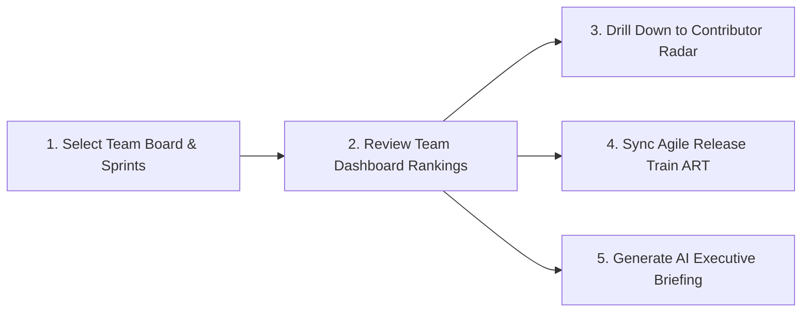

# DeliverIQ — User Guide & Operations Manual

> **Engineering Delivery Intelligence, Contributor Analytics & Agile Release Train Synchronization**  
> *Built natively on Atlassian Forge with Custom UI for Jira Cloud.*

---

## 📑 Table of Contents

1. [Introduction & Core Philosophy](#1-introduction--core-philosophy)
2. [Quick-Start Walkthrough](#2-quick-start-walkthrough)
3. [Module-by-Module Guide](#3-module-by-module-guide)
   - [3.1 Team & Sprint Selection](#31-team--sprint-selection)
   - [3.2 Team Dashboard & Contributor Ranking](#32-team-dashboard--contributor-ranking)
   - [3.3 Individual Contributor Radar](#33-individual-contributor-radar)
   - [3.4 Agile Release Train (ART) Sync](#34-agile-release-train-art-sync)
   - [3.5 Multi-Team Portfolio Tracker](#35-multi-team-portfolio-tracker)
   - [3.6 AI Executive Briefing Generator](#36-ai-executive-briefing-generator)
   - [3.7 Governance, Approvers & Settings](#37-governance-approvers--settings)
4. [DeliverIQ Scoring Engine & Mathematical Proofs](#4-deliveriq-scoring-engine--mathematical-proofs)
5. [Engineering Manager Playbook: 1-on-1s & Retrospectives](#5-engineering-manager-playbook-1-on-1s--retrospectives)
6. [Frequently Asked Questions (FAQ) & Troubleshooting](#6-frequently-asked-questions-faq--troubleshooting)

---

## 1. Introduction & Core Philosophy

**DeliverIQ** is a delivery analytics and program synchronization platform designed for Engineering Directors, Program Managers (RTEs), Engineering Managers, and Scrum Masters.

### Why DeliverIQ?
Traditional performance reviews and retrospective metrics often rely on subjective impressions or simplistic issue counts. DeliverIQ transforms raw Jira Software telemetry into **objective, multi-dimensional delivery metrics**:

- **Deterministic & Auditable:** Every number is derived from immutable Jira issue changelogs, resolution dates, due dates, story points, and comments.
- **Fair & Normalized:** Delivered velocity and peer collaboration are normalized against the team's average delivery.
- **Privacy & Security First:** Runs entirely inside the Atlassian Forge trust boundary (`api.asUser()`) with zero external data egress.

---

## 2. Quick-Start Walkthrough



1. **Open DeliverIQ in Jira:** Access **DeliverIQ** from your global Jira apps navigation.
2. **Select Board & Sprints:** Choose your team's Scrum board and 1 to 4 sprints.
3. **Generate Dashboard:** Click **Generate Team Dashboard** to calculate live metrics.
4. **Explore Modules:** Use the top navigation bar to seamlessly jump between Team Rankings, Contributor Radars, ART Sync, and Executive Briefings.

---

## 3. Module-by-Module Guide

### 3.1 Team & Sprint Selection
- **Board Dropdown:** Displays all accessible Jira Software Scrum boards.
- **Sprint Selector:** Multi-select 1 to 4 sprints. For best baseline reliability, select **2 to 3 consecutive closed sprints**.
- **Auto-Discovery:** DeliverIQ automatically discovers your Jira instance's custom Story Points field (e.g. `customfield_10016`, `customfield_10028`).

---

### 3.2 Team Dashboard & Contributor Ranking

The Team Dashboard ranks all team members by their composite **DeliverIQ score** (0 to 100+).

#### Key Metrics & Aggregates:
- **Average Team DeliverIQ:** Overall composite health score of the team.
- **Delivered Velocity:** Total story points resolved across the selected sprints.
- **On-Time Rate:** Percentage of due-dated tasks resolved on or before their due date.
- **Incident Density:** Total reopens, review regressions, and defect links across the team.

#### Contributor Performance Tiers:
| Tier | Score Range | Color | Description |
| :--- | :---: | :---: | :--- |
| **Strong Contributor** | **$\ge 90$** | 🟢 Green | Outperforming peer velocity with exceptional on-time reliability and clean delivery. |
| **On Track** | **$75 – 89$** | 🔵 Blue | Consistently meeting sprint commitments and definition-of-done criteria. |
| **Below Target** | **$60 – 74$** | 🟡 Amber | Delivery friction in velocity, late completions, or review rejections. |
| **Needs Attention** | **$< 60$** | 🔴 Red | High blocker density, persistent carry-over, or defect churn requiring manager support. |

#### Actions:
- **Export CSV:** Download a full CSV spreadsheet of all contributor metrics and raw issue counts.
- **Live Invalidation / Refresh:** Clear the cached calculation to fetch fresh real-time data from Jira.

---

### 3.3 Individual Contributor Radar

Click any row on the Team Dashboard to open that engineer's dedicated detail screen.

#### What You Will See:
1. **Four-Pillar Performance Radar:** Visual score cards for On-Time Delivery, Delivered Velocity, Work Quality, and Collaboration.
2. **Behavioral Signal Detectors:**
   - **Sprint Carry-Over Rate:** Tasks carried past their original committed sprint.
   - **Review Regressions:** Number of times tickets moved backwards from *In Review* to *In Progress*.
   - **Unauthorized Due Date Drift:** Due dates changed without manager/approver authorization.
3. **Targeted Coaching Suggestions:** Specific, actionable recommendations linked to actual Jira keys (e.g. `PROJ-142`).

---

### 3.4 Agile Release Train (ART) Sync

Designed for SAFe Program Increment (PI) execution and cross-team delivery alignment.

#### Core Features:
- **Cross-Team & Workstream Tracking:** Monitor execution across engineering squads.
- **Interactive KPI Cards:**
  - *Epics Committed*
  - *Tasks Committed vs. Completed*
  - *Iteration Performance %*
  - *Story Points Committed vs. Delivered*
- **Click-to-Inspect Modals:** Click any KPI card to immediately open a modal listing all contributing Jira issues with clickable links.
- **Collapsible Iteration Objectives:** Track high-level business milestones and deliverable goals.

---

### 3.5 Multi-Team Portfolio Tracker

Manage and monitor multi-board delivery portfolios in one unified view.

- **Team Preset Manager:** Save and quickly toggle between custom board groupings (e.g., *Payments Core*, *Mobile App Squad*, *Infrastructure*).
- **Cross-Project Epic Rollup:** Dual completion metrics measuring both **Story Point Completion %** and **Task Count Cadence %**.
- **Investment Distribution (SPACE / DX Framework):**
  - 🚀 **Features:** New value creation (Stories, Epics).
  - 🛠️ **Tech Debt:** Refactoring and architecture maintenance.
  - 🐛 **Bugs:** Defects and hotfixes.
  - ⚙️ **Maintenance:** Ops, build pipelines, and maintenance chores.

---

### 3.6 AI Executive Briefing Generator

Synthesizes complex multi-board Jira telemetry into natural-language briefings formatted for VP/CTO executive leadership:

- **Overall Health Status:** Instant visual rating (*HEALTHY*, *NEEDS ATTENTION*, *AT RISK*).
- **Executive Summary:** Polished, concise narrative paragraph.
- **Key Highlights & Wins:** Top delivered features and milestones.
- **Active Bottlenecks & Critical Risks:** Flagged cross-team blockers.
- **Recommended Action Items:** Clear next steps for engineering leaders.
- **One-Click Copy:** Copy formatted briefing to clipboard for Slack, Teams, or Executive Email updates.

---

### 3.7 Governance, Approvers & Settings

Configure DeliverIQ to align with your organization's policies:

- **Custom Scoring Weights:** Adjust the 4 category weights (must total 100%).
- **Authorized Due Date Approver:** Designate authorized managers using Jira user search. Any due date modifications made by other users will be flagged as unauthorized drift.
- **Story Points Field Discovery:** Verify or override the custom field ID used for estimation.
- **Cache Management:** View cache status and clear storage when needed.

---

## 4. DeliverIQ Scoring Engine & Mathematical Proofs

$$\text{DeliverIQ} = w_{\text{onTime}} \cdot S_{\text{onTime}} + w_{\text{delivered}} \cdot S_{\text{delivered}} + w_{\text{quality}} \cdot S_{\text{quality}} + w_{\text{collab}} \cdot S_{\text{collab}}$$

### 4.1 On-Time Delivery ($S_{\text{onTime}}$) — 35% Default Weight
Evaluates resolution timestamp ($R$) against the issue due date ($D$):

$$S_{\text{onTime}} = \min\left(\text{Round}\left(\frac{\text{OnTimeIssues}}{\text{EligibleIssues}} \times 100\right), \, 100\right)$$

- **Eligibility Rule:** Requires $\ge 3$ due-dated tasks (`MIN_DATED_ISSUES = 3`).
- If fewer than 3 dated tasks exist, $S_{\text{onTime}} = \text{null}$ and a neutral baseline of 60 is applied.

---

### 4.2 Delivered Velocity ($S_{\text{delivered}}$) — 25% Default Weight
Measures story points resolved relative to the team average:

$$S_{\text{delivered}} = \min\left(\text{Round}\left(\frac{P_{\text{person}}}{P_{\text{teamAvg}}} \times 100\right), \, 120\right)$$

- **120% Velocity Cap:** Prevents point inflation from dominating overall scores while appropriately rewarding top contributors.
- **Fallback Weighting:** If story points are not used on a ticket, deterministic fallback weights apply:
  - *Bug:* 1 point
  - *Task / Sub-task:* 2 points
  - *Story:* 3 points
  - *Epic:* 5 points

---

### 4.3 Work Quality ($S_{\text{quality}}$) — 25% Default Weight
Evaluates total delivery churn and incidents:

$$\text{Incidents} = \text{ReopenedTasks} + \text{ReviewRegressions} + \left\lceil\frac{\text{LinkedBugs}}{2}\right\rceil$$

Scores are determined by calibrated incident bands:
| Incidents Count | Quality Score | Evaluation |
| :---: | :---: | :--- |
| **0 – 1** | **100** | Pristine delivery quality |
| **2 – 3** | **85** | Minor acceptable iteration |
| **4 – 5** | **70** | Moderate quality friction |
| **6 – 8** | **50** | Elevated defect churn |
| **9+** | **30** | Critical stabilization required |

---

### 4.4 Collaboration & Reviews ($S_{\text{collab}}$) — 15% Default Weight
Rewards peer assistance, PR reviews, and architectural guidance:

$$S_{\text{collab}} = \min\left(\text{Round}\left(\frac{C_{\text{person}}}{C_{\text{teamAvg}}} \times 100\right), \, 120\right)$$

- **Substantive Comments Only:** Filters comments $>20$ characters on tickets where $\text{Assignee} \ne \text{Author}$.
- Capped at **120%**.

---

## 5. Engineering Manager Playbook: 1-on-1s & Retrospectives

DeliverIQ is designed to enable **empathy-driven, data-backed coaching conversations**.

### 1-on-1 Discussion Matrix

```
┌──────────────────────────────────────┬────────────────────────────────────────────────────────────┐
│ Observed Signal                      │ Recommended Manager Coaching Approach                      │
├──────────────────────────────────────┼────────────────────────────────────────────────────────────┤
│ High Carry-Over Rate (>40%)          │ "Let's review task decomposition during planning.           │
│                                      │ Would splitting 5+ point stories into smaller sub-tasks    │
│                                      │ prevent sprint spillovers?"                                │
├──────────────────────────────────────┼────────────────────────────────────────────────────────────┤
│ Elevated Review Regressions          │ "We noticed multiple tasks kicked back from Review to Dev. │
│                                      │ Let's ensure acceptance criteria and automated test runs  │
│                                      │ are verified before requesting reviews."                   │
├──────────────────────────────────────┼────────────────────────────────────────────────────────────┤
│ Unauthorized Due Date Drift          │ "Dates were moved on several tasks without prior alignment.│
│                                      │ Let's flag timeline risks during daily standups early."    │
├──────────────────────────────────────┼────────────────────────────────────────────────────────────┤
│ High Collaboration Score (>100)      │ "Your code reviews and technical feedback on teammates'    │
│                                      │ tickets have elevated team quality. Thank you!"            │
└──────────────────────────────────────┴────────────────────────────────────────────────────────────┘
```

---

## 6. Frequently Asked Questions (FAQ) & Troubleshooting

### Q: Why is an engineer's On-Time score showing as N/A or neutral?
**A:** DeliverIQ requires at least 3 completed tasks with both a `duedate` and a `resolutiondate` to produce a statistically reliable On-Time score. When fewer than 3 dated tasks exist, DeliverIQ applies a neutral 60 baseline to avoid penalizing engineers for un-dated tasks.

### Q: How does DeliverIQ handle tickets without story points?
**A:** If your team does not assign story points to certain issue types (e.g. bugs or chores), DeliverIQ applies standard deterministic fallback weights: Bug = 1 SP, Task = 2 SP, Story = 3 SP.

### Q: Can we adjust the scoring weights?
**A:** Yes! Go to **Settings**, modify the 4 category sliders/inputs to reflect your team's current focus (e.g., higher Quality weight during a hardening sprint), and save. DeliverIQ ensures the weights always total 100%.

### Q: How do I refresh metrics after updating Jira tickets?
**A:** Click the **Refresh Data** button on the Team Dashboard or clear cache in Settings to pull the latest changelog events directly from Jira.

---

*DeliverIQ — Built for high-performing engineering organizations.*
